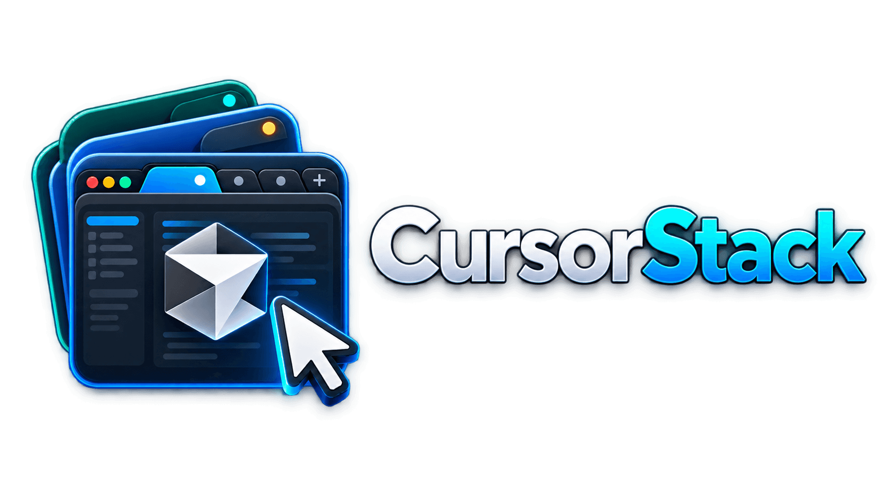
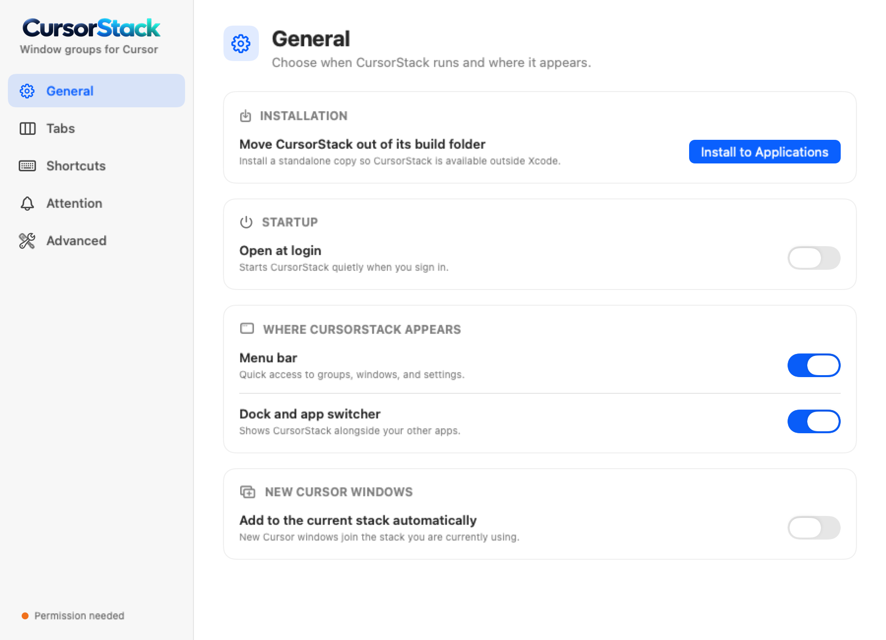
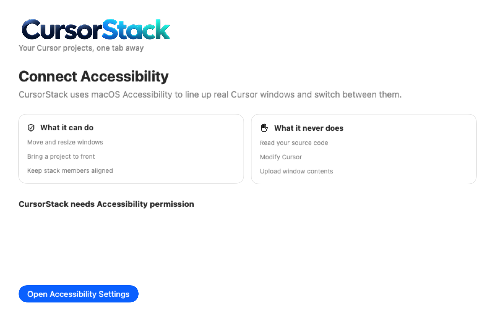

# JamesWare CursorStack

<p align="center">
  
</p>

Native macOS utility that groups Cursor windows into a logical tabbed stack. CursorStack does not embed or modify Cursor; it aligns real Cursor windows beneath a dedicated tab strip.

## Download

Download the latest signed and notarized build from [GitHub Releases](https://github.com/JewhurstEngineering/cursor-stack/releases/latest/download/CursorStack-1.0.4.zip).

1. Unzip and open CursorStack.
2. Click **Install to Applications** in Settings.
3. Grant Accessibility permission when prompted.

CursorStack checks GitHub Releases for signed updates using [Sparkle](https://sparkle-project.org/). Update archives are independently verified before installation.

## What it looks like

<p align="center">
  
</p>

<p align="center">
  
</p>

## Requirements

- macOS 14 or newer
- Apple silicon Mac
- Cursor
- Accessibility permission
- Optional: Notifications
- Optional: Screen Recording for experimental visual attention detection

## How it works

CursorStack uses macOS Accessibility APIs to discover, move, resize, and focus Cursor windows. It is intentionally **not App Sandboxed** because sandboxed apps cannot control windows owned by another process. Releases use Hardened Runtime, Developer ID signing, and Apple notarization.

Nothing is uploaded. CursorStack has no account or backend and does not read your source code. The only network request is Sparkle checking the public GitHub release feed for updates.

## Build from source

Requirements: Xcode 26+, macOS 14+, and your own Apple Development signing team.

```bash
git clone https://github.com/JewhurstEngineering/cursor-stack.git
cd cursor-stack
open CursorStack.xcodeproj
```

Select your signing team in Xcode, then build the `CursorStack` scheme. The committed Xcode project is ready to use.

Maintainers can regenerate it from [`project.yml`](project.yml):

```bash
xcodegen generate
```

For a command-line Debug build:

```bash
./scripts/release.sh Debug
open build/Build/Products/Debug/CursorStack.app
```

The maintainer Release build requires a Developer ID Application certificate, a local `notarytool` profile named `notary`, and the CursorStack Sparkle key in the login keychain:

```bash
./scripts/release.sh Release
```

The script signs, notarizes, staples, verifies, and writes the update ZIP and `appcast.xml` to `artifacts/`. Credentials and private keys are never stored in this repository.

## Usage

1. Open several Cursor project windows.
2. Create a stack from the menu bar icon or window picker.
3. Click tabs or use global shortcuts to switch projects.

The tab strip sits above Cursor’s native title bar, so Cursor’s search field remains usable. Clicking another app hides it like a normal window. Closing CursorStack leaves Cursor windows open.

**Settings** is under CursorStack → Settings… (`⌘,`) or the menu bar icon → Settings…. It includes installation, launch at login, appearance, tab ordering, shortcuts, attention, and diagnostics.

Drag tabs directly to reorder them, or open **Manage Groups and Tab Order…** from the Group menu, menu bar icon, or a tab’s context menu. Use the small grip beside the CursorStack logo when you want to move the whole stack.

## Shortcuts

These global shortcuts can be changed under **Settings → Shortcuts**. CursorStack warns about duplicate assignments and common macOS conflicts.

- `⌃⌥ ]` next tab
- `⌃⌥ [` previous tab
- `⌃⌥ 1`–`9` jump to tab

## Notes

- Groups persist in `~/Library/Application Support/CursorStack/`
- Green traffic light fills the current display work area (not a macOS Space)
- Drag a tab onto another group’s tab strip to move it
- Dashed tabs are saved windows that need **Reconnect** after Cursor restarts. Hover the ×, right-click, or use **Remove Closed Tabs** to dismiss them.
- Attention is best-effort (Accessibility, then titles, then optional visual capture)
- Nothing is uploaded. No account.

## Project status

CursorStack is an independent open-source project and is not affiliated with, endorsed by, or sponsored by Anysphere or Cursor. Cursor is a trademark of its respective owner.

## License

[MIT](LICENSE)
